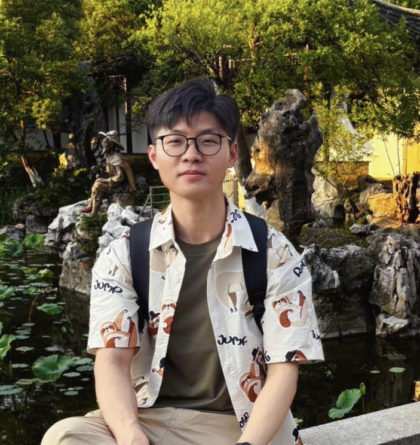
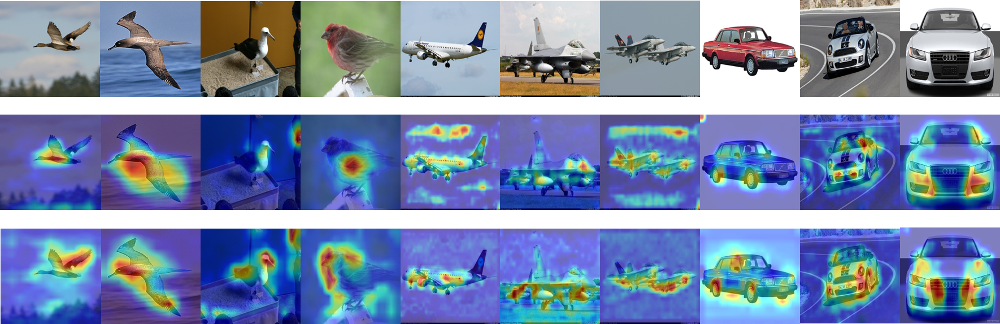
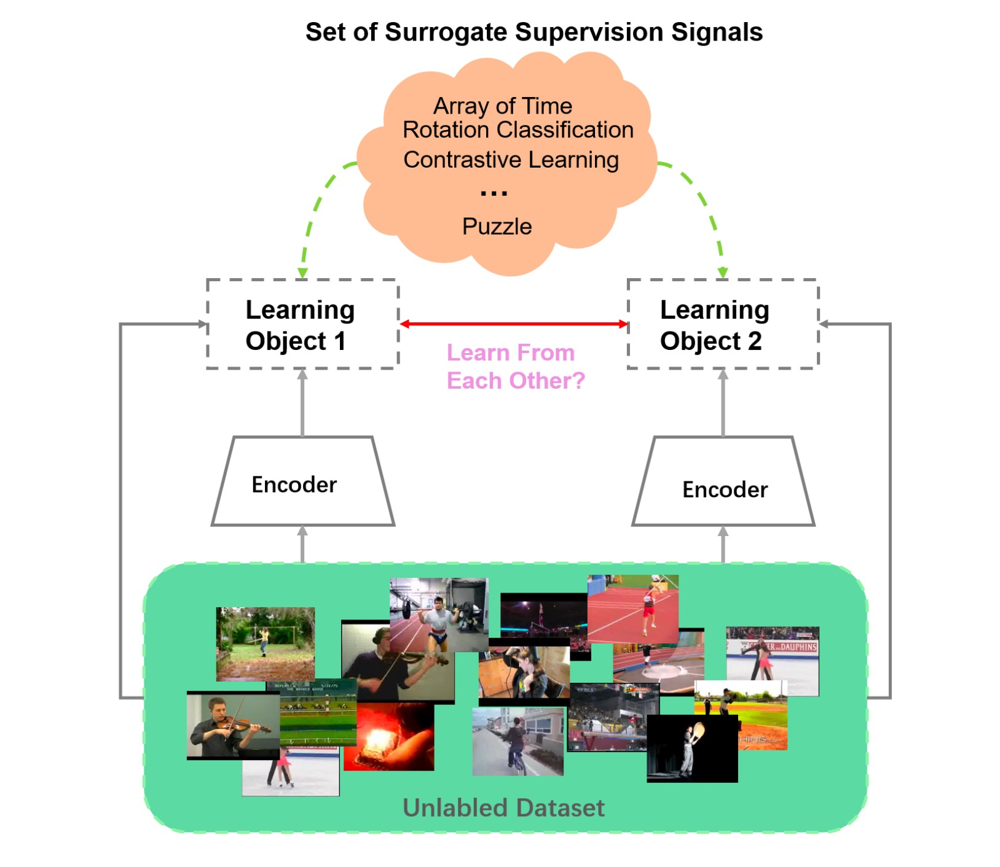
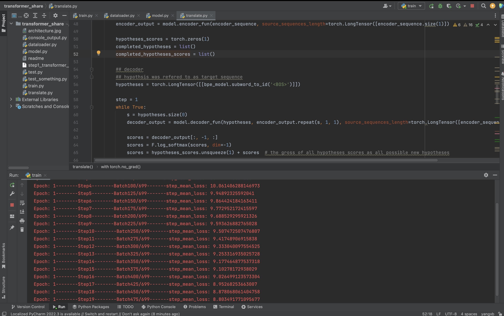
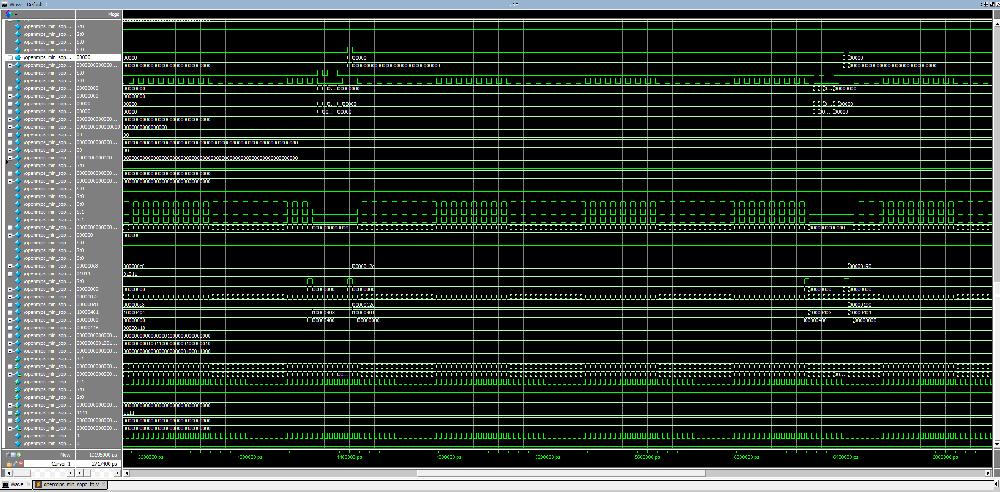
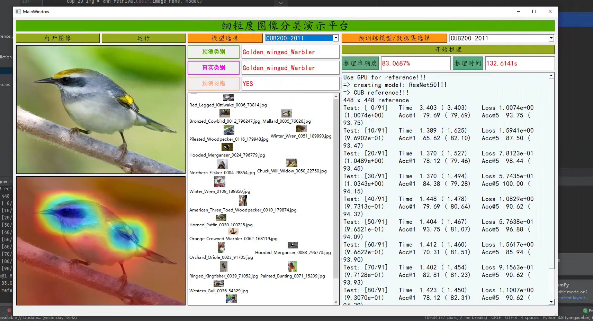

  <!-- 头像和个人信息 -->
  

    

      
    

    

      <h1 class="name">杨学彬</h1>
      
<i class="fas fa-envelope"></i> yangxb23@mail2.sysu.edu.cn

      
<i class="fas fa-briefcase"></i> 南昌经济技术开发区投资促进局员工

      

        

          <i class="fab fa-zhihu"></i> <a href="https://www.zhihu.com/people/bu-neng-shuo-de-mi-mi-47-56"target="_blank">知乎</a>
          |
          <i class="fab fa-twitter"></i> <a href="https://x.com/Jimmy_xby" target="_blank">Twitter</a>
           | 
          <i class="fab fa-cuttlefish"></i> <a href="https://blog.csdn.net/weixin_42693876?type=blog" target="_blank">CSDN</a>
        

        

          <i class="icon octicon octicon-mark-github"></i> <a href="https://github.com/xuebin-yang" target="_blank">Github</a>
           | 
          <i class="fab fa-bilibili"></i> <a href="https://account.bilibili.com/account/home?spm_id_from=333.1007.0.0" target="_blank">Bilibili</a>
        

      

    

  

  <!-- 分隔线 -->
  

  <!-- 个人介绍 -->
  

    
👋 Hi there, I am Xuebin Yang(杨学彬), My research interests are in Self-supervised Learning, Intergrate Circuit Design and Language learing. I obtained my bachelor’s degree in Electronic Information Engineering from Henan Polytechnic University (HPU), later obtained master's degree in Integrated Circuit Engineering from Sun Yat-sen University (SYSU), where I was supervised by Prof. Jianguo Hu and Prof. Lu Zhu. I am currently a tenure staff of the Investment Promotion Bureau of Nanchang Economic and Technological Development Zone.

  

  <!-- 分隔线 -->
  

  <!-- 个人动态 -->
  

      

        📰
        Personal News
      

      

        
· 2025年9月，建站成功，慢慢将csdn和其他博客内的内容搬运过来

        
· 2024年12月，在南昌市委党校中青年干部培训班培训，学制1.5月，获得优秀学员

        
· 2024年5月，度过了精神状态最差的一年多

        
· 2022年12月，买了人生中第一台车

        
· 2022年8月，进入南昌经济技术开发区投资促进局电子信息产业专班工作，任科员

        
· 2022年6月，研究生正式毕业，成为光荣的 sysu alumni

      

    

    <!-- 分隔线 -->
    

    <!-- 论文发表 -->
    <!--定义论文栏内容-->
    

      

        📄
        Publications
      

      

        

          
          

            
Self-supervised Fine-grained Image Classification via Progressive Global Disturbance

            
4rd International Conference on Computer Science and Software Engineering

            
Xuebin Yang, Jianguo Hu, Ziming Wang, Fanglei Xu, Lu Zhu

            

              <a href="https://dl.acm.org/doi/10.1145/3494885.3494907">paper link</a>
               | 
              <a href="https://github.com/xuebin-yang">github</a>
            

          

        

      

      

        

          
          

            
Self-supervised mutual learning for video representation learning

            
2021 IEEE International Conference on Multimedia and Expo (ICME)

            
Jinpeng Wang, Yutong Li, Jianguo Hu, Xuebin Yang, Yanyu Ding

            

              <a href="https://www.computer.org/csdl/proceedings-article/icme/2021/09428338/1uilysNhScU">paper link</a>
               | 
              <a href="https://github.com/xuebin-yang">github</a>
            

          

        

      

    

    <!--论文栏内容结束-->
    <!-- 分隔线 -->
    

    <!--定义个人项目内容-->
    

      

        💻
        Projects
      

      

        

          
          

            <a href="./projects/en-ge-model.md" class="project-name">Transformer based Chinese German Translation Model</a>
            
April 2025 - May 2025

          

        

        

          
          

            <a href="/projects/mips.html" class="project-name">Design of 32-bit 5-stage pipeline CPU based on MIPS instruction set system</a>
            
March 2024 - June 2024

          

        
  
        

          
          

            <a href="/projects/fgcv.html" class="project-name">The system of Fine-grained Visual Classification</a>
            
February 2022 - April 2022

          

        

        

          
          

            <a href="/projects/yolov5.html" class="project-name">Mask recognition system based on YOLO v5 model</a>
            
May 2021 - October 2021

          

        

      

    

    <!--个人项目内容结束-->
    <!-- 分隔线 -->
    

    <!--定义个人特长栏内容-->
    

      

        🎯
        Profile
      

      

        

          
Developing

          
C/C++、Python、Verilog、Git、Linux、PyTorch、Xilinx FPGA、PyQt5

        

        

          
Language

          

            Mandarin（native）、
            Cantonese（native-like）、
            English（fluent）、
            Jiujiang Duchang dialect（native）、
            Liling Zhuzhou dialect（Proficient）

        

        

          
Hobby

          

              Crosstalk（have been listening almost ten years）、
              Standup Comedy（美式和粤式栋笃笑）、
              Football、Reading
          

        

      

    

    <!-- 分隔线 -->
    

